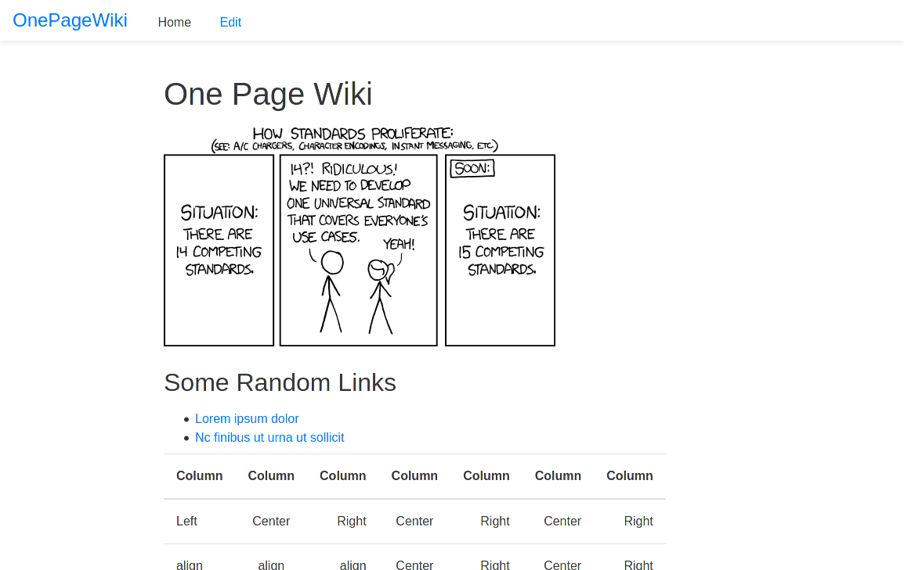

# OnePageWiki
Single page markdown wiki.

**Use Case:** When you want a webpage thats easily editable and no other BS. Zero JS.



## Deployment Instructions:
* Create a binary using `go build -o OnePageWiki .`
* Create a new folder called Wiki on your server.
* Copy the binary and the following files/folders: `templates`, `static`, `config.env`, `wiki.md` into that folder.
* `chmod +x OnePageWiki`
* Create a systemd service for the binary.
* If you want https, use a reverse proxy.

## Configuration
You can change configuration in `config.env`. If you want a hashed wiki editor password instead of plaintext, you can edit config.go to use bcrypt.
```
WIKIUSER="admin"
WIKIPASS="password"
WIKIPORT=8000
WIKITITLE="OnePageWiki"
WIKIMARKDOWNFILE="./wiki.md"
```

Uncomment the dark mode section in `static/css/style.css` for dark mode.

## Other
Used libraries: go-chi, goldmark markdown parser, godotenv, Marx CSS. 
Built this entire thing in less than two hours.